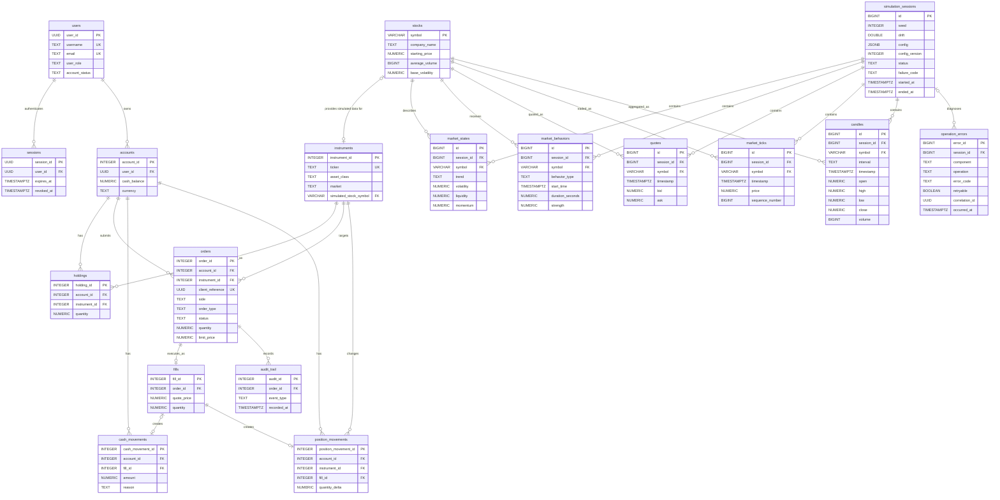

# Trading Platform Database

This directory contains the consolidated PostgreSQL schema for a trading platform backed by the FMS simulated U.S. stock market.

The schema combines two responsibilities:

- **FMS market simulation:** reproducible simulation sessions, stocks, market behaviors, quotes, ticks, and candles.
- **Trading platform:** users, login sessions, accounts, instruments, orders, fills, balances, holdings, and audit history.

The source of truth is [`Trading Platform Schema.sql`](./Trading%20Platform%20Schema.sql). It is a destructive bootstrap script intended for local development: running it drops and recreates its tables. Do not run it against a database containing data that must be retained.

## Builds

The SQL file is organized as one executable script with six logical builds.

### Build 1 — Identity and access

| Table | Responsibility |
| --- | --- |
| `users` | Stores login identity, profile, role, account status, security counters, and user-level execution settings. Passwords are stored only as hashes. |
| `sessions` | Tracks individual authenticated sessions, expiry, activity, and revocation. A user can have multiple sessions. |

This build establishes who can use the platform and how authenticated access is revoked without changing trading or market data.

### Build 2 — Simulation setup and instruments

| Table | Responsibility |
| --- | --- |
| `simulation_sessions` | Defines one deterministic FMS run using a random seed, versioned JSON configuration, lifecycle status, failure summary, and simulated start/end times. |
| `stocks` | Holds symbol-keyed simulation configuration for the U.S. stocks generated by FMS, including starting price, volume, and volatility settings. |
| `instruments` | Represents assets the trading platform can trade, including equities, FX, and crypto. `simulated_stock_symbol` optionally links a U.S. equity to FMS. |
| `accounts` | Represents a user's brokerage account and its cached single-currency cash balance. |

`stocks` is simulator configuration, while `instruments` is the broader catalog of assets the platform can recognize as tradable. An instrument may optionally map to one `stocks` row as its simulated market-data source. FMS currently generates only supported U.S. stocks, while instruments can also represent other asset classes.

### Build 3 — Market behavior and state

| Table | Responsibility |
| --- | --- |
| `market_states` | Stores the current trend, volatility, liquidity, and momentum for each stock in a simulation session. There is one current row per session and symbol. |
| `market_behaviors` | Keeps the append-only history of behaviors applied to a stock, including their start, duration, and strength. |

State is the current snapshot; behavior rows are history. Both are scoped to a simulation session so a run can be reproduced or deleted independently.

### Build 4 — Generated market data

| Table | Responsibility |
| --- | --- |
| `quotes` | Stores timestamped bid/ask snapshots and available sizes. |
| `market_ticks` | Stores the raw simulated trade stream, including price, quote context, volume, and a globally ordered sequence number within the session. |
| `candles` | Stores OHLCV bars aggregated from ticks for a requested interval. |

All generated rows use `(session_id, symbol)` to identify their run and stock. Constraints enforce valid spreads, prices within the spread, positive volumes, ordered tick sequences, and valid candle boundaries.

### Build 5 — Orders, execution, and accounting

| Table | Responsibility |
| --- | --- |
| `holdings` | Caches the current quantity held by an account for an instrument. |
| `orders` | Records a client's buy/sell side, market/limit type, idempotent client reference, and lifecycle independently of execution. |
| `fills` | Records the execution price and quantity for a successfully executed order. The schema currently permits at most one fill per order. |
| `cash_movements` | Append-only history of cash added to or removed from an account by fills, deposits, and withdrawals. |
| `position_movements` | Append-only history of instrument quantities added to or removed from an account by fills. |

`accounts.cash_balance` and `holdings.quantity` are convenient current-value caches. `cash_movements` and `position_movements` explain how those current values were reached and are used to reconcile them.

### Build 6 — Audit and query support

| Object | Responsibility |
| --- | --- |
| `audit_trail` | Stores permanent order-lifecycle events such as submission, acceptance, rejection, fill, or execution failure. |
| `operation_errors` | Stores one centralized, sanitized row per unexpected operational failure without adding an error log to every domain table. |
| Query indexes | Support session listing, active-session lookup, deterministic replay, symbol-filtered history, behavior history, and unresolved-error investigation. |

The application database role should receive `INSERT` and `SELECT`, but not `UPDATE` or `DELETE`, on append-only ledger and audit tables.

`operation_errors` is for unexpected technical failures. Expected business outcomes stay on their owning records, while stack traces and secrets stay in protected structured application logs.

## Core terminology

- A `stock` row configures how FMS generates data for one supported U.S. stock. An `instrument` is the broader platform representation of something tradable, including equities, FX, and crypto. An instrument's nullable `simulated_stock_symbol` selects an FMS stock as its market-data source.
- A `quote` is market data containing the current bid and ask; it does not belong to a user. An `order` is an account's instruction to trade an instrument and may later be evaluated against market data.
- `orders.side` is `BUY` or `SELL`. `orders.order_type` is `MARKET` or `LIMIT`; only a limit order has a positive `limit_price`. `client_reference` is unique per account so retrying the same client request does not create a duplicate order.
- `market_states` is the current snapshot of volatility, liquidity, momentum, and trend for a session and symbol. `market_behaviors` is the append-only history of timed scenarios that influence that state. They remain separate because one is current state and the other is historical input.
- `cash_movements` records signed changes to account cash. `position_movements` records signed changes to instrument quantity. Their sums reconcile the current cached values in `accounts` and `holdings`.

## Data flow

1. Create a `simulation_sessions` row with the seed, configuration version, and `CREATED` lifecycle status for a run.
2. Generate state and behavior rows for symbols registered in `stocks`.
3. Generate `quotes` and `market_ticks`; aggregate ticks into `candles`.
4. Link a tradable U.S. equity in `instruments` to its FMS symbol through `simulated_stock_symbol`.
5. Submit an `order`, record a successful execution in `fills`, and append the related cash and position movements.
6. Record each lifecycle transition in `audit_trail`.

Deleting a simulation session cascades through its generated state and market data. It does not delete stock reference data, instruments, accounts, or trading records.

## Schema diagram

The diagram shows foreign-key relationships. `instruments.simulated_stock_symbol` is optional: an instrument can use an FMS stock configuration as its simulated market-data source. All other displayed child relationships use required foreign keys except `cash_movements.fill_id`, which is absent for deposits and withdrawals.



## Lifecycle, replay, and diagnostics

Simulation status is constrained to `CREATED`, `RUNNING`, `PAUSED`, `COMPLETED`, `FAILED`, or `RESET`. Terminal sessions require `ended_at`. Only failed sessions may retain `failure_code` or a sanitized `failure_detail`.

Tick sequence numbers are globally unique within a simulation session through `UNIQUE (session_id, sequence_number)`, matching the simulator's global sequence generator. Quotes use `UNIQUE (session_id, symbol, timestamp)` for idempotent persistence retries. Candle identity remains `UNIQUE (session_id, symbol, interval, timestamp)`.

The schema deliberately uses one `operation_errors` table rather than per-table error logs. Each row represents one failure occurrence and carries a correlation ID that can be matched to protected application logs. Counts and trends should be calculated with queries or reporting views rather than overwriting or grouping individual incidents.

## Indexing strategy

Indexes are tied to expected access paths:

- Session creation order and active-session discovery.
- Global tick replay through the tick uniqueness index.
- Symbol-filtered tick replay and timestamp-range history.
- Latest/history lookups for quotes through their uniqueness index.
- Candle lookup through the existing candle uniqueness index.
- Behavior history and unresolved operational errors.

PostgreSQL automatically indexes primary keys and unique constraints. The schema therefore does not create duplicate quote or candle indexes. BRIN indexes, table partitioning, and additional foreign-key indexes should be added only after measured row growth and `EXPLAIN (ANALYZE, BUFFERS)` output demonstrate a need.

## Cache and Redis policy

Redis is intentionally deferred. PostgreSQL is the historical source of truth, while the running simulator may continue to use its bounded process-local latest-state views. Before adding a distributed cache, measure query latency, query frequency, connection usage, and multi-worker consistency requirements.

Reconsider Redis when multiple application workers need shared latest state, repeated latest-quote reads materially load PostgreSQL, or immutable completed-session pages become a demonstrated hot path. If introduced, use cache-aside with session-scoped keys and bounded TTLs; PostgreSQL remains authoritative.

## Running the build

Run these commands from the `Simulated_Engine` directory.

The script requires PostgreSQL with the `pgcrypto` extension available.

PowerShell:

```powershell
psql $env:DATABASE_URL -v ON_ERROR_STOP=1 -f "Platform/Trading Platform Schema.sql"
```

Bash:

```bash
psql "$DATABASE_URL" -v ON_ERROR_STOP=1 -f "Platform/Trading Platform Schema.sql"
```

Because this is a destructive bootstrap build, use the numbered files under [`../migrations`](../migrations/) for incremental FMS schema changes.

## Important assumptions

- FMS migrations `0001` through `0008` are the incremental simulator baseline. This consolidated bootstrap includes additional planned lifecycle, replay-ordering, idempotency, diagnostics, and indexing improvements that require future numbered migrations before application wiring.
- Simulation configuration starts at version `1`; application changes that alter its meaning must increment the version.
- PostgreSQL is authoritative for persisted history; Redis is deferred until measurements justify a distributed cache.
- FMS currently simulates U.S. equities only.
- One order produces at most one fill; partial fills are not currently modeled.
- Each account has one cached cash balance and currency rather than multiple currency wallets.
- Personally identifiable information such as SSNs must be encrypted or tokenized before production use.
- Reporting and analytics stores are downstream concerns and are not included in this schema.
