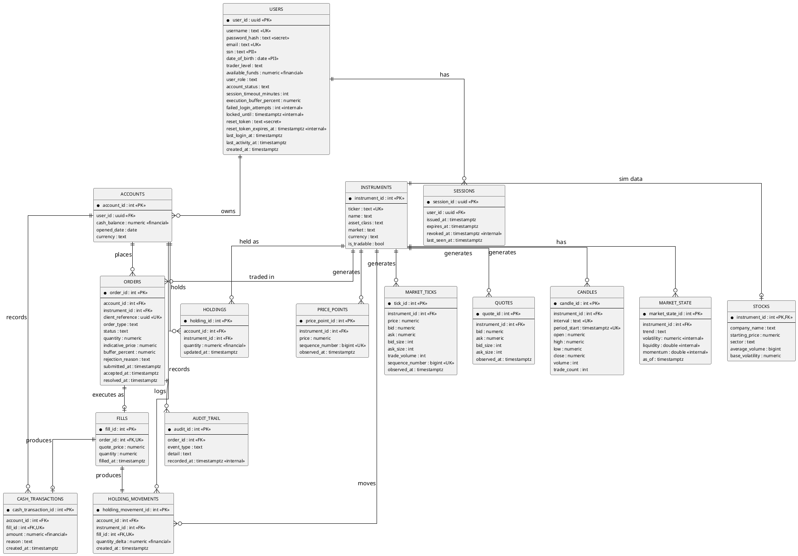

# Dua LEAPa — Database Visualization

Companion diagram for [dua-leapa-schema.sql](./dua-leapa-schema.sql). Shows every
table, its columns, key attributes, and how tables relate.

## Legend — column attributes

| Tag | Meaning |
|---|---|
| `PK` | Primary key |
| `FK` | Foreign key (references another table) |
| `UK` | Unique constraint |
| *(no tag)* | Plain column, not unique/keyed |

| Sensitivity label (in quotes) | Meaning |
|---|---|
| `"PII"` | Personally identifiable — must be encrypted/tokenised, never logged or returned as-is |
| `"secret"` | Credential/token material — never expose via API or logs |
| `"internal"` | System/derived state — not user-facing, but not sensitive |
| `"financial"` | Money or position data — read-access should be scoped to the owning user/admin only |
| *(no label)* | Public-safe — ok to expose to the owning user or in normal API responses |

## Entity-relationship diagram

Column tags/sensitivity labels follow the legend above; enum values and long-form notes live in [dua-leapa-schema.sql](./dua-leapa-schema.sql) comments, not repeated here to keep this compact.

## Table groups, at a glance

- **Identity & access**: `users`, `sessions` — who can log in, and which sessions are live.
- **Reference data**: `instruments`, `stocks` — what can be traded.
- **Market data (FMS-fed)**: `price_points` (live today), `market_ticks`, `quotes`, `candles`, `market_state` (reserved for later FMS phases, empty for now).
- **Money & positions**: `accounts`, `holdings` — current-state caches.
- **Trading pipeline**: `orders` → `fills` → `cash_transactions` + `holding_movements` (the ledgers) → `audit_trail` (permanent record).
